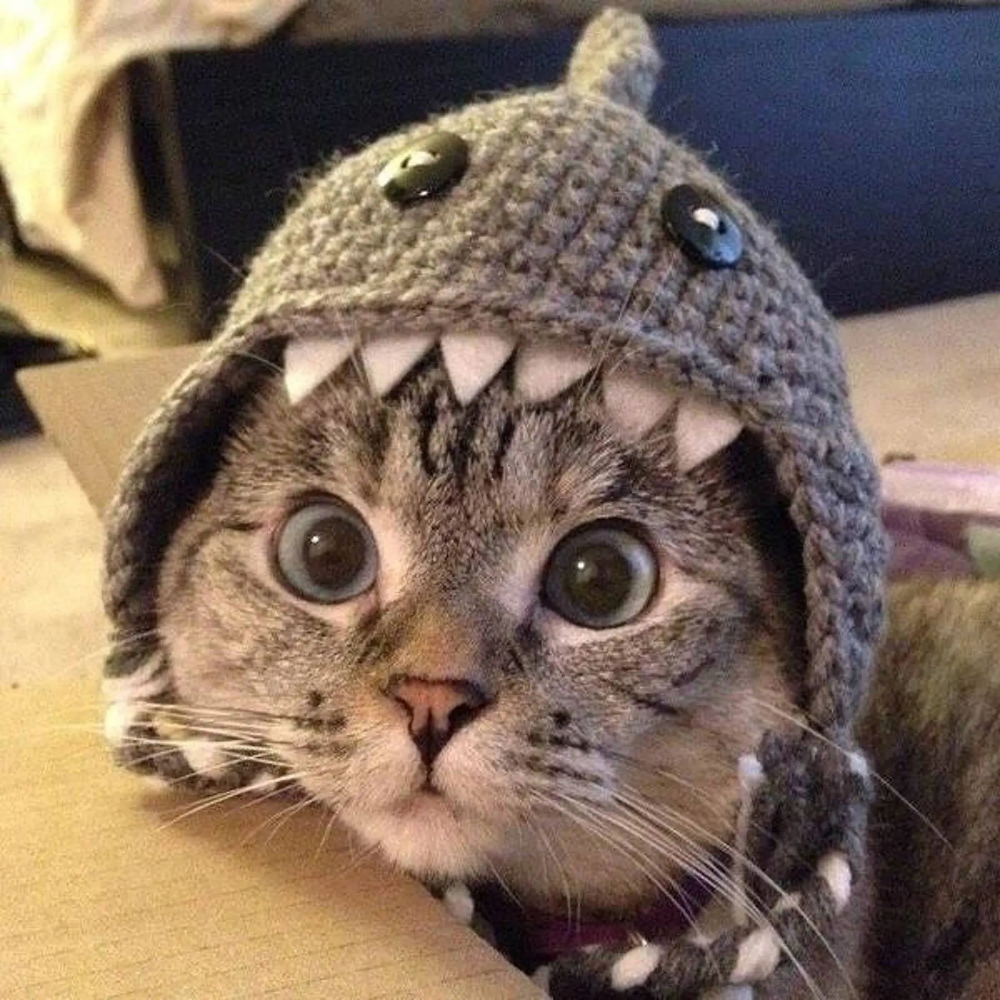

  

    <h3>Hello!</h3>
    
Based in the United Kingdom, I am a student who focuses on Science and the analysis of data. My academic background focuses on Chemistry, Physics, and Statistics, where I enjoy exploring the fundamental laws of the natural world and the data behind them.

    
Aside from studies, I focus my time on Photography, Research, and homelabbing. For example, I photograph the world around me using a Canon 1000D and Adobe Lightroom Classic. <a href="/photography" style="color: #f43f5e; font-weight: bold; text-decoration: underline;">Take a look at some of my photographs here!</a>

	
Regarding the research, I am producing research papers on things that interest me. For example, I am currently creating a research paper on the Enigma Code; specifically on its history pre-world-war, its usage in the war, how the machines work, and the bombe that was used to crack the code during the second world war. I am also looking to produce another research paper on the Large Hadron Collider (LHC) at CERN. <a href="/publications" style="color: #f43f5e; font-weight: bold; text-decoration: underline;">My finished papers can be found here!</a>

	
Finally, the homelabing hobby is a large and constantly growing hobby. I have a server stack which I am constantly upgrading and messing around with, to create things like this website, an XRAY VPN, a windows SMB server, etcetera. My latest project has been the creation of this website, and its hosting from my servers.

	

  <a href="https://instagram.com/lb.photography.gb" style="background: #f43f5e; color: white; padding: 8px 16px; border-radius: 8px; text-decoration: none; font-size: 0.9rem; font-weight: 600;">Instagram</a>
  <a href="mailto:contactme@lbweb.uk" style="background: #4b5563; color: white; padding: 8px 16px; border-radius: 8px; text-decoration: none; font-size: 0.9rem; font-weight: 600;">Email</a>
  <a href="https://github.com/DrTabpp" style="background: #1f2937; color: white; padding: 8px 16px; border-radius: 8px; text-decoration: none; font-size: 0.9rem; font-weight: 600;">GitHub</a>
  <a href="https://discord.com/users/drtaboo" style="background: #5865f2; color: white; padding: 8px 16px; border-radius: 8px; text-decoration: none; font-size: 0.9rem; font-weight: 600;">Discord</a>

  

  

    
  

